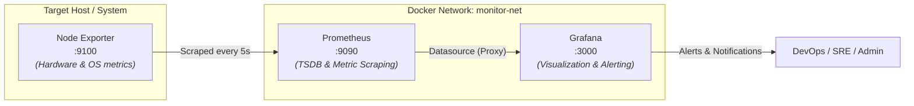
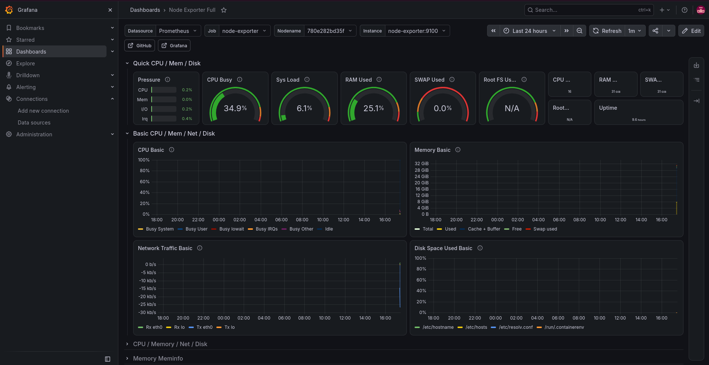
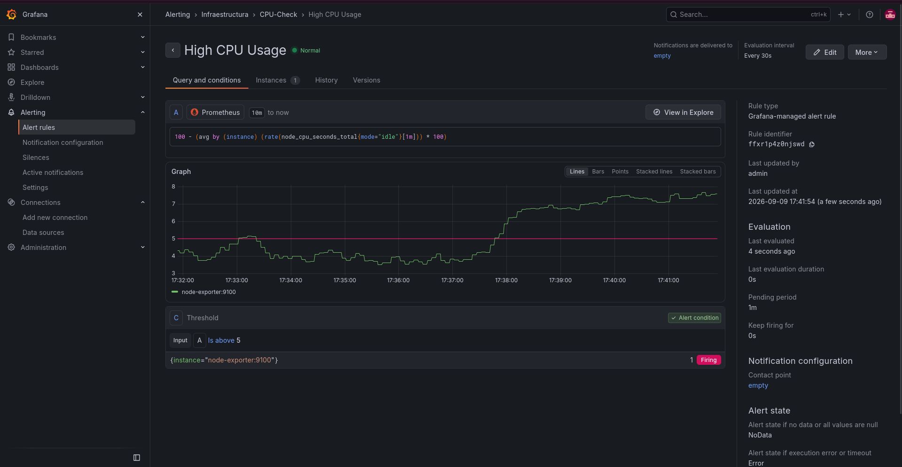

# 📊 Observability Stack: Prometheus, Grafana & Node Exporter

A lightweight, production-ready observability and monitoring stack containerized with Docker Compose. This stack provides real-time system metrics collection, persistent time-series storage, intuitive Grafana dashboards, and automated alert management.

---

## 🏗️ Architecture Overview

The observability pipeline follows a pull-based monitoring model:



1. **Node Exporter**: Collects system-level hardware and OS metrics (CPU, memory, disk, network) from the host machine.
2. **Prometheus**: Automatically scrapes metrics from Node Exporter at 5-second intervals, storing them in a persistent time-series database.
3. **Grafana**: Automatically connects to Prometheus via pre-configured provisioning, visualizing metrics on rich dashboards and managing alert thresholds.

---

## 📁 Repository Structure

```
.
├── docker-compose.yml                 # Orchestration configuration for all services
├── docs/
│   └── images/
│       ├── alert-firing.png           # Example of an alert triggering on high CPU
│       └── dashboard.png              # System monitoring overview dashboard
├── grafana/
│   └── provisioning/
│       └── datasources/
│           └── datasource.yml         # Auto-provisioned Prometheus datasource
└── prometheus/
    └── prometheus.yml                 # Prometheus scrape interval and target configurations
```

---

## 🚀 Quick Start

### Prerequisites

Ensure you have the following installed on your system:
- [Docker](https://docs.docker.com/get-docker/) (20.10+)
- [Docker Compose](https://docs.docker.com/compose/install/) (v2.0+)

### 1. Launch the Stack

Clone this repository and run the containers in detached mode:

```bash
docker compose up -d
```

### 2. Verify Services

Check that all containers are healthy and running:

```bash
docker compose ps
```

Expected output:
```text
NAME            IMAGE                       COMMAND                  SERVICE         STATUS         PORTS
grafana         grafana/grafana:latest      "/run.sh"                grafana         running        0.0.0.0:3000->3000/tcp
node-exporter   prom/node-exporter:latest   "/bin/node_exporter"     node-exporter   running        0.0.0.0:9100->9100/tcp
prometheus      prom/prometheus:latest      "/bin/prometheus --c…"   prometheus      running        0.0.0.0:9090->9090/tcp
```

---

## 🌐 Services & Endpoints

| Service | Port | Default Credentials | Description | URL |
| :--- | :--- | :--- | :--- | :--- |
| **Grafana** | `3000` | `admin` / `admin` | Visual analytics and alerting dashboard | [http://localhost:3000](http://localhost:3000) |
| **Prometheus** | `9090` | _None_ | Metrics TSDB, scraping engine, and PromQL console | [http://localhost:9090](http://localhost:9090) |
| **Node Exporter** | `9100` | _None_ | Raw host OS and kernel metrics exporter | [http://localhost:9100/metrics](http://localhost:9100/metrics) |

> [!NOTE]
> Grafana is pre-configured with `admin / admin` credentials in [docker-compose.yml](file:///home/ibrahim/Documents/GitHub/observability-stack/docker-compose.yml). You will be prompted to change this on your first login, or you can update `GF_SECURITY_ADMIN_PASSWORD` in the Compose file.

---

## 📈 Visualizing Metrics in Grafana

Grafana comes with Prometheus automatically configured as the default datasource via [datasource.yml](file:///home/ibrahim/Documents/GitHub/observability-stack/grafana/provisioning/datasources/datasource.yml).

### Importing the Node Exporter Full Dashboard

To monitor your host system with full fidelity:
1. Open Grafana at [http://localhost:3000](http://localhost:3000).
2. Go to **Dashboards** > **New** > **Import**.
3. Enter Dashboard ID `1860` (the standard **Node Exporter Full** community dashboard) and click **Load**.
4. Select `Prometheus` as the data source and click **Import**.

### Dashboard Preview



This dashboard provides comprehensive real-time visibility into:
- **CPU & System Load**: Total CPU usage percentage, per-core utilization, system load averages.
- **Memory & Swap**: Available, cached, and buffered RAM versus active usage.
- **Disk I/O & Storage**: Disk reads/writes, filesystem capacity, and IOPS.
- **Network Traffic**: Bandwidth consumption, receive/transmit rates (Rx/Tx), and interface errors.

---

## 🚨 Alerting & Thresholds

Grafana's unified alerting system evaluates metrics continuously against defined thresholds.

### Example: High CPU Usage Alert

An alert rule can monitor whether CPU utilization surpasses a safety threshold.

- **Folder / Group**: `Infraestructura` / `CPU-Check`
- **Metric Query (PromQL)**:
  ```promql
  100 - (avg by (instance) (rate(node_cpu_seconds_total{mode="idle"}[1m])) * 100)
  ```
- **Condition**: Alert triggers when CPU usage `is above 5%` (or custom threshold e.g. `80%`) for longer than `1m`.

### Alert Firing Preview



### Testing the Alert (Simulate CPU Load)

You can trigger and verify the alert by generating artificial CPU load on the host:

```bash
# Using a temporary docker container running an infinite computation loop:
docker run --rm -it alpine sh -c "while :; do :; done"
```

Within 1 minute, Grafana's alert status will transition from `Normal` to `Pending` and finally to **`Firing`**, as illustrated in the screenshot above.

---

## ⚙️ Configuration Details

### 1. Prometheus Scrape Configuration ([prometheus.yml](file:///home/ibrahim/Documents/GitHub/observability-stack/prometheus/prometheus.yml))

```yaml
global:
  scrape_interval: 5s

scrape_configs:
  - job_name: "node-exporter"
    static_configs:
      - targets: ["node-exporter:9100"]
```
- Metrics are polled every `5s` for granular, near real-time updates.

### 2. Automatic Datasource Provisioning ([datasource.yml](file:///home/ibrahim/Documents/GitHub/observability-stack/grafana/provisioning/datasources/datasource.yml))

```yaml
apiVersion: 1

datasources:
  - name: Prometheus
    type: prometheus
    access: proxy
    url: http://prometheus:9090
    isDefault: true
```
- No manual datasource connection setup is needed when launching Grafana for the first time.

### 3. SELinux Compatibility

Volume mounts in [docker-compose.yml](file:///home/ibrahim/Documents/GitHub/observability-stack/docker-compose.yml) include the `:ro,Z` flag (e.g. `./prometheus/prometheus.yml:/etc/prometheus/prometheus.yml:ro,Z`) to ensure compatibility with SELinux-enforced distributions (Fedora, RHEL, CentOS, AlmaLinux).

---

## 🛑 Stopping & Teardown

To stop the running stack without losing metric history:
```bash
docker compose stop
```

To stop and remove all containers and the network:
```bash
docker compose down
```

To wipe all persisted Prometheus time-series data and Grafana dashboards:
```bash
docker compose down -v
```

---

## 📜 License

This project is open source and available under the [MIT License](LICENSE).
